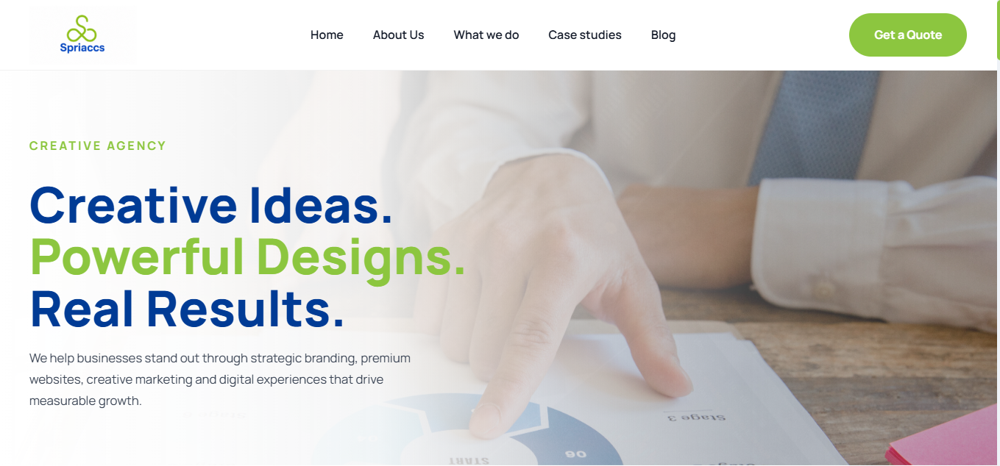

Spriaccs Corporate Website

A full-stack corporate website with a custom-built admin CMS, developed for a freelance client. The public site is backed by a PHP/MySQL admin panel that lets the client manage content, respond to quote requests, and run newsletter campaigns without touching code.

Overview

Rather than a static brochure site, Spriaccs was built as a small content management system: everything from blog posts to portfolio items to service listings is stored in MySQL and managed through a secured admin dashboard, then rendered dynamically on the public-facing pages.

Tech Stack
Back-end: PHP
Database: MySQL (schema included at database/spriaccs.sql)
Front-end: HTML, CSS, JavaScript
Version control: Git / GitHub

Features
Public Site
Home, About, Services, Portfolio, Blog/Article, and Project pages, all served dynamically from the database
Quote request form for prospective clients
Newsletter subscribe / unsubscribe flow with status handling
Privacy Policy and Terms pages

Admin Panel (/admin)
Authenticated login/logout (auth.php, login.php, logout.php)
Dashboard overview
Full CRUD for Blog posts, Portfolio items, and Services (add / edit / delete)
Quote requests: view individual submissions and export
Newsletter management: view subscribers, export list, bulk-delete entries
Site settings page for managing global configuration
Shared layout components (header.php, sidebar.php, topbar.php, footer.php) for a consistent admin UI

## 📸 Screenshots

Here is a complete look at the website views:

### Homepage

### App Views & Features

Project Structure

Spriaccs_Final/
├── admin/
│   ├── assets/
│   │   ├── css/        # admin.css, dashboard.css, login.css, portfolio.css
│   │   ├── images/
│   │   └── js/         # admin.js, portfolio.js, service.js
│   ├── includes/        # auth.php, connection.php, header.php, sidebar.php, topbar.php, footer.php
│   ├── dashboard.php
│   ├── login.php / logout.php
│   ├── add-*.php, edit-*.php, delete-*.php    # blog, portfolio, service CRUD
│   ├── bulk-delete-newsletter.php, bulk-delete-quote.php
│   ├── export-newsletter.php, export-quote.php
│   ├── newsletter.php, quote.php, services.php, portfolio.php
│   ├── settings.php, save-settings.php
│   └── view-project.php, view-quote.php
├── css/                  # about, animations, blog, portfolio, project, quote, responsive, service, style
├── js/                   # main.js, newsletter.js, portfolio.js, slider.js
├── database/
│   └── spriaccs.sql      # full database schema/dump
├── includes/              # connection.php, settings.php
├── png/                   # branding assets, sliders, logos
├── uploads/               # blog/, logo/, portfolio/ — user-uploaded media
├── index.php, about.php, services.php, portfolio.php, blog.php, article.php, project.php
├── quote.php, privacy.php, terms.php
├── newsletter-subscribe.php, newsletter-unsubscribe.php, newsletter-status.php
└── .gitignore
